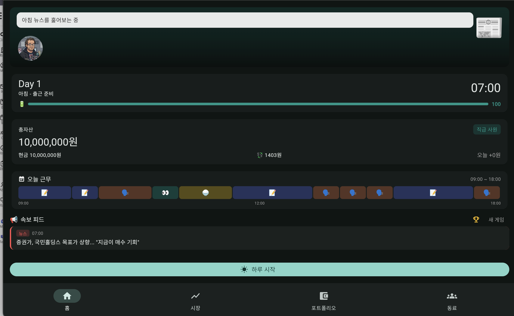
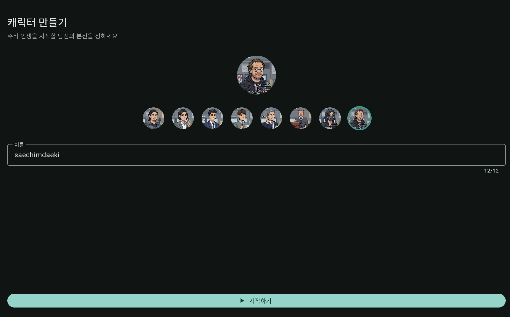
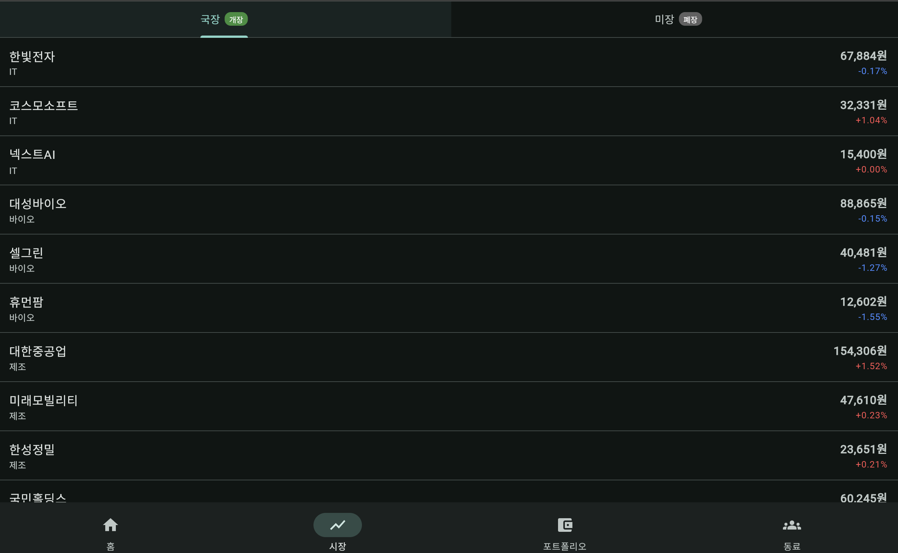
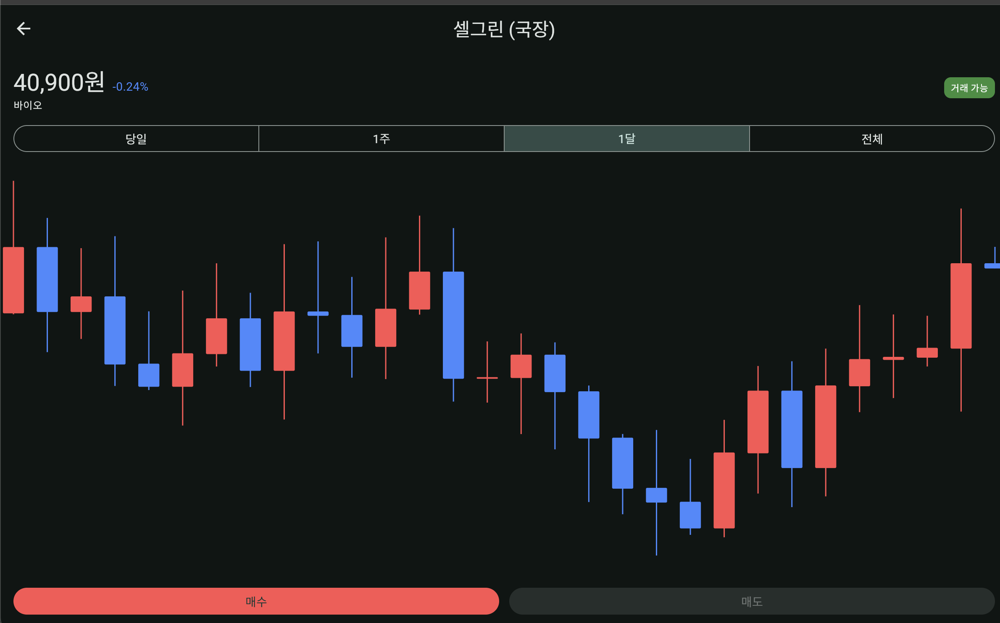
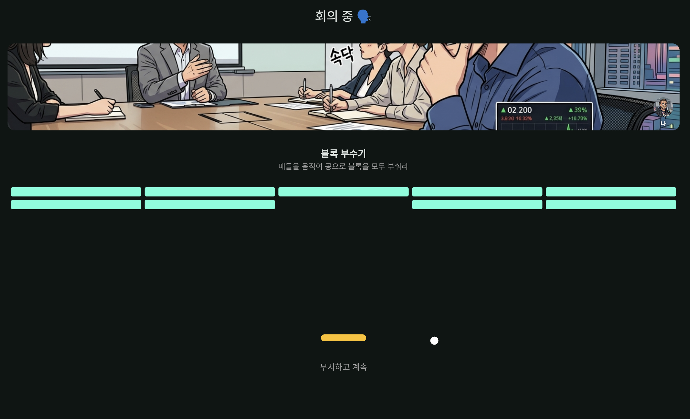
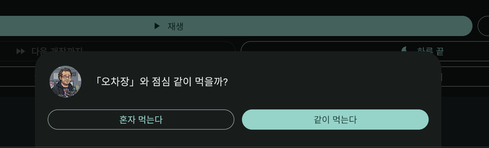
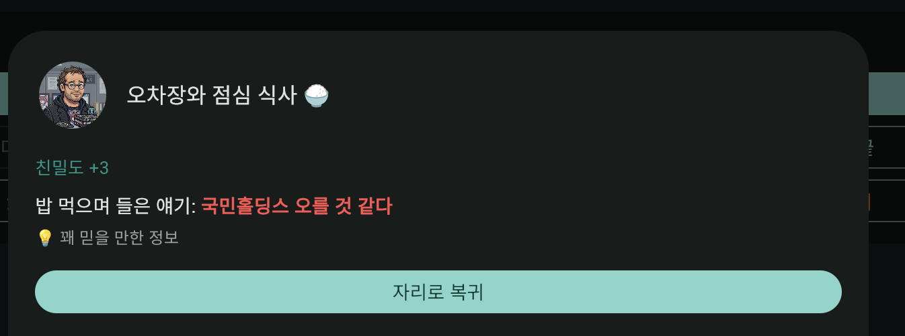
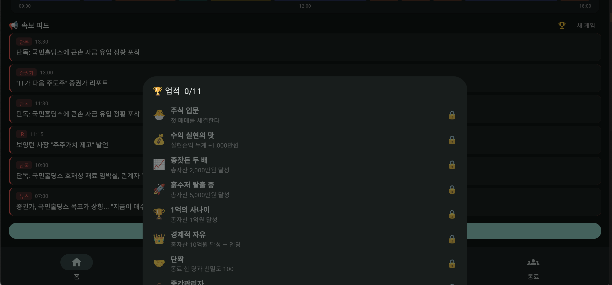

<div align="center">

# 📈 주식 인생 (Stock Life Game)

### 월급쟁이 개미로 시작해 **경제적 자유**까지 — 직장 생활 주식 시뮬레이션

상사 눈치 보며 몰래 매매하고, 동료에게 정보를 캐고, 몬테카를로로 튜닝된 진짜 시장에서
10억을 만들어 회사를 탈출하는 그날까지.




</div>

---

## 🎯 어떤 게임인가

**"직장 다니며 주식으로 부자되기"** 컨셉의 모바일 싱글플레이 시뮬레이션 게임입니다.

평범한 신입사원으로 입사해, 근무 중 상사 몰래 폰으로 매매하고, 담배타임·회식에서 동료와
친해져 정보를 얻고, 월급을 모아 종잣돈을 굴립니다. 시장은 예쁘게 꾸민 눈속임이 아니라
**GBM(기하 브라운 운동) 기반에 섹터 상관·뉴스 이벤트·변동 환율까지 얹은 진짜 시뮬레이션
엔진**이고, 수천 일 몬테카를로로 밸런스를 검증했습니다. 공짜 수익은 없고, **정보와 타이밍으로
이기는** 게임입니다.

## ✨ 이런 게 재밌습니다

- 🤫 **상사 몰래 매매하는 긴장감** — 회의에 끌려가 미니게임(5종)을 성공하면 30초간 시간이 멈춘 채 자유 매매 찬스. 실패하면 "회의 집중 좀 하지?" 한 소리.
- 🕵️ **정보전** — 동료 6명의 신뢰도가 다 다르고, 텔레그램형 속보 피드의 '단독' 힌트는 **실제 진행 중인 이벤트 방향과 연동**된다. 누구 말을 믿을지가 실력.
- 📈 **진짜 시장 엔진** — 어닝 서프라이즈·M&A 루머·CPI/FOMC 일정·장중 돌발까지. 호재는 주가에 즉시 점프 + 며칠간 드리프트로 반영되고, 바닥까지 무너지면 **상장폐지**로 휴지조각.
- 🍺 **직장인 라이프** — 회식 가면 취해서 차트가 춤추고 시간이 훌쩍, 야근·심야 매매로 **컨디션**이 깎이면 미니게임도 어려워지고 눈도 침침해진다.

## 📸 스크린샷

<table>
  <tr>
    <td width="50%"><br><b>🎭 캐릭터 생성</b><br>아바타 8종 중 내 분신을 고른다</td>
    <td width="50%"><br><b>📊 시장</b><br>국장·미장 종목과 실시간 등락, 💡팁 배지</td>
  </tr>
  <tr>
    <td width="50%"><br><b>📈 종목 차트</b><br>캔들 차트 + 매수/매도</td>
    <td width="50%"><br><b>🗣 회의 미니게임</b><br>성공하면 30초 시간정지 몰래 매매</td>
  </tr>
  <tr>
    <td width="50%"><br><b>🍚 점심 제안</b><br>동료와 같이 갈까?</td>
    <td width="50%"><br><b>💡 정보 획득</b><br>친밀도 +3, "국민홀딩스 오를 것 같다"</td>
  </tr>
  <tr>
    <td width="50%"><br><b>🏆 업적</b><br>첫 매매부터 10억까지 11종</td>
    <td width="50%" align="center"><br><br><br><b>🎬 그리고…</b><br><br>총자산 <b>10억</b> 달성 →<br>경제적 자유 엔딩<br><br>…물론 내일도 출근은 해야 한다.</td>
  </tr>
</table>

## 🎮 게임플레이

게임 내 하루가 실시간으로 흐릅니다:

> **07:00 기상**(아침 뉴스·월급·귀띔) → **09~18시 근무**(랜덤 일정표, 몰래 매매) → **저녁**(회식 찬스) → **23:30 미장** → **02:00 취침**(오버나이트 정산)

- 국장(09:00~15:30)·미장(23:30~06:00) 두 거래소. 미장은 **변동 환율**(일 랜덤워크, 1,250~1,550원)로 원화 환산 매매 — 환차손익 발생
- 배속 1x/2x/4x, "다음 개장까지"·"하루 끝" 스킵. 30일마다 월급, 60일마다 승진(사원 → 임원)
- 총자산 **10억** 달성 시 경제적 자유 엔딩 (이후에도 계속 플레이 가능)

<details>
<summary><b>구현된 시스템 자세히 보기</b></summary>

### 시장
- GBM 주가 시뮬레이션 + 섹터 상관 + 이벤트 점프(호재/악재 ~20종 + 중립 변동성, 기대 ~1.3건/일)
- **장중 돌발 이벤트**: 개장 중 낮은 확률로 개별 종목 이벤트가 터지고 🚨속보 알림
- **2단계 루머**: M&A 피인수설 → 다음 날 아침 30% 인수 확정(급등) / 70% 결렬(펌핑 반납)
- **정기 매크로 일정**: 매월 CPI(10일)·FOMC(20일), D-3부터 피드 예고, 당일 방향 50/50
- **상장폐지**: 바닥까지 붕괴한 종목은 장마감에 폐지 — 보유분은 휴지조각
- **IPO**: 5일차부터 낮은 확률로 대기 풀에서 신규 상장(고변동성 종목)
- 종목 차트: 당일/1주/1달/전체 토글, 새 게임 시 과거 30일 일봉 합성

### 직장
- 캐릭터 생성(이름 + 아바타 8종). 아바타는 벡터 기본, `assets/images/avatar_<id>.png`로 교체 가능
- 매일 랜덤 근무 일정표(회의·업무 몰입·보고서·상사 외근·점심), 홈에 가로 타임라인으로 표시
- 근무 인터랙션(하루가 멈추고 팝업):
  - **회의** → 미니게임 5종(눈치 타이밍·연타·블록 부수기·순서 기억·숫자 찾기). 성공 시 [동료와 장난(친밀도)] / [몰래 주식 30초] 선택
  - **담배타임 / 점심 / 커피 챗 / 회식** → 같이 가면 친밀도 + 종목 팁

### 동료 (8명)
- 성향 7종: 흡연 / 회식러 / 정보통 / 신입 / 일벌레 / 인싸 / 투자고수 — 정보 신뢰도 각자 다름
- 친밀도 0~100, 팁 적중률에 가산. 친밀도 100 성향별 보너스(투자고수=재료 잔여일, 인싸=인맥 버프, 일벌레=컨디션 회복)

### 뉴스 피드
- 텔레그램형 속보 피드: 아침 뉴스/공지 + 장중 실시간 속보(채널·시각·톤 색상)
- 속보의 일부는 실제 진행 중인 이벤트 방향을 흘리는 **'단독' 힌트**(방향은 진짜) — 나머지는 노이즈

### 컨디션 (0~100)
- 회식 -25, 심야 매매 -10(하루 1회), 수면 +30(취하면 +20)
- 낮으면: 미니게임 난이도 상승(40 미만), 차트 흐림 + 팁 적중률 하락(30 미만)

### 업적 · 엔딩
- 업적 11종(첫 매매, 자산 마일스톤, 승진, 친밀도, 생존일). 달성 시 알림+피드, 홈 🏆에서 열람
- 총자산 10억 = 경제적 자유 엔딩

</details>

## 🛠 기술 스택 & 아키텍처

**Flutter** · **Riverpod**(상태) · **fl_chart**(차트) · **Hive**(로컬 저장)

게임 로직 엔진은 UI 의존성이 0이라, 화면 없이 `flutter test`로 수천 일 몬테카를로
시뮬레이션을 돌려 밸런스를 검증합니다.

```
lib/
├── engine/        # 순수 Dart 게임 로직 (UI 의존성 0)
│   ├── clock/     #   게임 시간·근무 일정표
│   ├── market/    #   주가 시뮬레이션 (GBM, 섹터 상관, 환율)
│   ├── events/    #   이벤트 테이블·가중치 추첨·효과 관리
│   └── portfolio/ #   매수/매도/손익 정산
├── data/          # 세션(월급·승진·친밀도·컨디션·업적·직렬화), 동료, 뉴스 피드, Hive 저장
└── ui/            # 화면·게임 루프 컨트롤러·캐릭터 아바타
```

## 🚀 실행

```bash
flutter run       # 실행 (기기/에뮬 또는 -d chrome)
flutter test      # 단위 테스트 68개 + 몬테카를로 밸런스 리포트 출력
flutter analyze   # 정적 분석
```

- 디버그 빌드에선 홈에 `🛠 회의⏩ / 🛠 저녁⏩` 점프 버튼이 떠서 인터랙션 테스트가 빠릅니다.
- 아트 에셋은 [`assets/images/`](assets/images/README.md)에 파일만 넣으면 자동 적용(없으면 코드 폴백).

## 🗺 로드맵

- [x] **Phase 1** — 시뮬레이션 엔진(주가/이벤트/포트폴리오) + 몬테카를로 검증
- [x] **Phase 1.5** — 국장/미장 거래소, 실시간 시계(09~18시 근무), 매크로 이벤트
- [x] **Phase 2** — MVP UI(홈/시장/종목상세·매매/포트폴리오) + Hive 로컬 저장
- [x] **Phase 2.5** — 캐릭터·동료·근무 인터랙션·미니게임·속보 피드·컨디션
- [x] **Phase 3** — 변동 환율, IPO/상장폐지, 업적, 경제적 자유 엔딩
- [ ] **Phase 4** — AdMob 수익화, 폴리시
- [ ] **Phase 4.5** — 이벤트 컷씬·연출(대형 이벤트 컷인, 회의/회식 컷씬, 엔딩 시퀀스, 효과음/BGM)
- [ ] **Phase 5** — Google Play 출시 → iOS 확장

---

> ⚠️ 본 게임의 주식 시장은 완전한 가상이며 실제 투자와 무관합니다.
>
> 📄 라이선스는 추후 추가 예정입니다.
